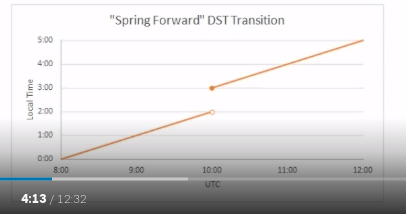

# Date and Time Fundamentals

All the notes here are from Matt Johnson's course in PluralSight on
[Date and Time
fundamentals](https://www.pluralsight.com/courses/date-time-fundamentals).

# The Human Problem

-   Clocks and calendars are human devices.
-   Humans tend to think about time locally.
-   Julius Caesar created [Julian
    Calender](https://en.wikipedia.org/wiki/Julian_calendar).
-   Pope Gergory XIII created [Gergorian
    calender](https://en.wikipedia.org/wiki/Gregorian_calendar).
    -   This is the most commonly used calender in the world.
    -   Changes made to how leap years are determined.
    -   Ommitted 10 days from October. So basically October 5th, 1582
        didn't exist. More details in the wikipedia page.
-   Other calenders: Hebrew, Buddhism, Islamic etc.
-   ISO-8601 - International Standards for Date and Time.
    -   This is what most computer systems follow.
    -   It also defines the calender system as Proleptic Gregorian
        Calender. It's also called as ISO calender.

# Universal Time

-   Single global point of reference. No Time Zones.
-   Synchronized via Network Time Protocol (NTP)
-   The first basis for a Universal time was GMT or Greenwich Mean Time.
    -   Since 1847.
-   UTC = Coordinated Universal Time
    -   Happened in 1972
    -   Preferred modern reference point
-   Primary difference between UTC and GMT:
    -   GMT has a civil definition.
    -   UTC has scientific definition. UTC also uses atomic clocks.
-   UTC also has leap seconds.
    -   These are one second periods that are added to the time scale to
        keep it perfectly in sync with another time scale called UT1.
-   Both UTC and UT1 are intended to stay in sync with earth's rotation.
    -   UTC is measured by atomic clocks.
    -   UT1 is measured by observing astronomical phenomenon.
    -   Because they aren't always in sync, we get leap seconds.
-   GMT or UTC ?
    -   There isn't much difference between then in modern times.
    -   In modern times, GMT is kept perfectly in sync with UTC. And
        hence the difference between them doesn't matter.
-   Use UTC when:
    -   As a timekeeping system
    -   As the reference point for a time zone offset. (UTC-07:00)
-   Use GMT:
    -   As part of the UK's time zone (GMT/BST)
    -   Civil purpose

# Daylight Saving Time

-   Government mandated clock adjustments.
-   Usually the clock is advanced forward by an hour in the spring, and
    is retracted backwards by an hour in the fall.
-   Also known as "Summer time".
-   Does not occur in every time zone.
-   Not applied the same way in every year. There is no guarantee that
    it's going to be the same in future years.

## Spring Forward Transition

-   Local time advances forward
    -   Usually by 1 hour
-   
-   Creates a "gap" of missing local time.
-   

## Fall Back Transition

-   Local time rewinds backwards
    -   Usually by 1 hour
-   
-   Creates an "overlap" of ambiguous local time.
-   

Software recommendation: If you are going to record value in terms of
local time, then you must also include the offset from UTC so that
during the overlap you can distinguish between the two possible
instances.

[<https://www.timeanddate.com/>](https://www.timeanddate.com/) is a good
reference to learn more details.
